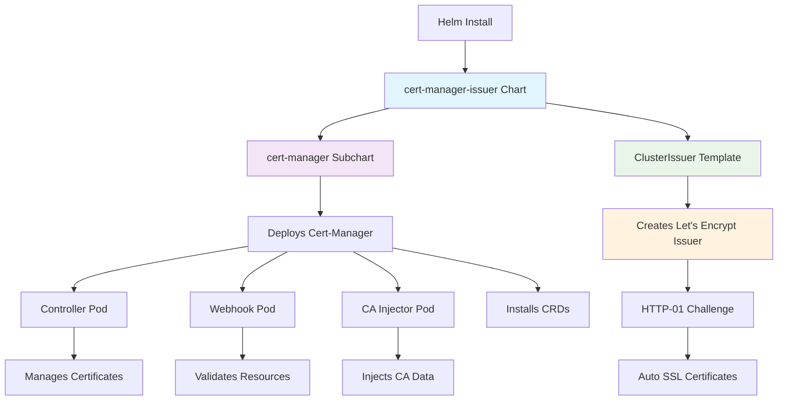

# **Cert-Manager with Let's Encrypt Issuer**

## **📦 Chart Architecture**

A **wrapper Helm chart** that bundles **cert-manager** with a pre-configured **Let's Encrypt ClusterIssuer** for automatic SSL certificate generation.



## **🎯 What Gets Deployed**

### **1. Cert-Manager (Subchart from Jetstack)**
- **Controller**: Manages certificate lifecycle
- **Webhook**: Validates certificate resources
- **CA Injector**: Injects CA certificates into pods
- **CRDs**: Certificate, Issuer, ClusterIssuer resources

### **2. Let's Encrypt ClusterIssuer**
- **Name**: `letsencrypt-http`
- **Type**: Cluster-scoped (works across all namespaces)
- **Challenge**: HTTP-01 (requires public endpoint)
- **Server**: Let's Encrypt staging (safe for testing)

## **⚡ Quick Start**

```bash
# Install the chart
helm install cert-manager-issuer . \
  --namespace cert-manager \
  --create-namespace
```

## **🔧 Configuration**

### **values.yaml**
```yaml
cert-manager:
  enabled: true
  installCRDs: true
  namespace: cert-manager
  replicaCount: 1
```

### **Auto-Certificate Setup**
Add to your Ingress:
```yaml
metadata:
  annotations:
    cert-manager.io/cluster-issuer: letsencrypt-http
spec:
  tls:
  - hosts:
    - your-app.com
    secretName: auto-tls-cert  # Will be created automatically
```

## **🔍 Verification**

```bash
# Check all components
kubectl get all -n cert-manager
kubectl get clusterissuers
kubectl get crd | grep cert-manager
```

## **📊 Component Flow**

```
User deploys Ingress with TLS
         ↓
cert-manager detects annotation
         ↓
Creates Certificate resource
         ↓
Let's Encrypt HTTP challenge
         ↓
Traefik serves challenge
         ↓
Certificate issued → Stored as Secret
         ↓
Traefik uses certificate for HTTPS
         ↓
Auto-renewal every 60 days
```

## **⚠️ Important Notes**

- **Testing**: Uses Let's Encrypt staging (no rate limits)
- **Production**: Change to production server after testing
- **Requirements**: Public domain + port 80 accessible
- **Ingress**: Must use Traefik as ingress class

## **🔄 Upgrade to Production**

Edit `templates/cluster-issuer.yaml`:
```yaml
server: https://acme-v02.api.letsencrypt.org/directory
```

## **🎯 Benefits**

- **Single chart** for cert-manager + issuer
- **Automatic certificate** creation
- **HTTP-01 challenge** (no DNS provider needed)
- **Built-in renewal** (30 days before expiry)
- **Cluster-wide** issuer (all namespaces)

---

**One chart, complete SSL automation for your Kubernetes cluster.**